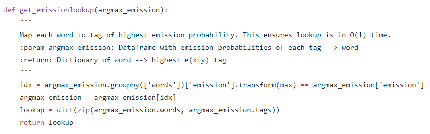

# 01_112_ml_project
Project for SUTD 01.112 Machine Learning Fall 2019

# 1. Instructions on running the code 

## 1.1 Part 2

## 1.2 Part 3

## 1.3 Part 4

## 1.4 Part 5

# 2. Explaining the code

## 2.1 Part 2

### 2.1.1 Part 2 Question 1 Emission probabilities
To work with the <b>training data</b>, we wrote a function defined as `readtopdftrain` that reads in the csv and shows the data as a DataFrame with the columns 'words' and 'tags' as shown below.  

To work with the <b>testing data</b>, we wrote another function called `readtopdftest` that returns a DataFrame with the columns 'words' and 'sentence id'. Words with the same sentence id will be part of the same sentence. This is to make it easier to split the sentences for the output file later.  
  \
To estimate the emission probabilities, in the training dataframe, we follow the following steps:  

 

We decided to use DataFrame as it is a very efficient way of storing the data and there are many ways of transforming the data quickly and efficiently using pandas' functions.

1. Create a new dataframe (`count_emit`) by grouping the rows of the dataframe by their tags, and then the words and finding the size of these groupings
2. Reset the index of `count_emit`.
3. Rename the size column as "count_emit".
4. Create another dataframe (`count_tags`) that counts the number of tags only
5. Lastly, merge the two dataframes together using the "tags" column and calculate the emission.
    - `count['emission']` = $\frac{`count["count_emit"]`}{`count["count_tags"]`}$
    - This follows the equation given:  
    
6. Drop the other two columns and leave the "emission" column.

### 2.1.2 Part 2 Question 2: Smoothing
We smooth the training data set using a function called `smoothingtrain`. 
  

The output would look like this:  

`smoothingtrain` calls a helper function (`replacewordtrain`) that replaces words that occur less than k times with the tag '#UNK#'.  
This function is applied to every single row in the dataframe using the `.apply` function.  
  

The output looks like this:  
  

Similarly, for the test data, we smooth it using a function called `smoothingtest`.  

This function calls the helper function `replacewordtest` that checks if the word is in the training data set. If it is, return the word. If not, replace it with the tag #UNK#.  

### 2.1.3 Part 2 Question 3: Simple Sentiment Analysis System
For this sentiment analysis system, we predict using the tag that gives us the maximum emission probability.
Firstly, we created a function (`get_emissionlookup`) that will map each word to the tag with the highest emission probability.
- Again, the function finds the indexes where the emission probability are the highest, then stores that in a column in a DataFrame with the words and tags.
- Finally, it returns the dataframe as a dictionary of words and predicted tags.

Next, the `get_tag_fromemission` function retrieves the tag for each word seen in the test set, and writes it out to a file.  

All of these functions are called in a `sentiment_analysis` function that will read in the data, smooth it, and write the predicted results to a file.  

## 2.2 Part 3 

### 2.2.1 Write a function that estimates the transition parameters from the training set using MLE (maximum likelihood estimation): Consider special cases for STOP and START
The `read_to_pdf` function here differs a bit from the ones coded in Part 2. We still create a dataframe, however, in this function, we have to append the 'START' and 'STOP' tags so as to run the Viterbi. Thus, we check for the first and last index, and append 'START' and 'STOP' accordingly. Also if the word is equal to an empty string, we append 'STOP' and then 'START' as it signifies the end of the old sentence and the start of the new one.  
Also, we create a new column called 'tags_next' that shows the tag in the sequence after the current one.

 

The output of `readtopdf` is as follows:  

Next, we create the `estimate_transition_parameters` function.  
Using the training dataframe passed to us, we group the rows in the dataframe by the tags again and count the number of tags in the dataframe.  
Next, we group the rows by the tags and then by tags_next, and count the number of tags_next per tags (transition of tag -> tag_next).  
- Note that we have to locate all of the tags_next that are empty string and replace them with the number zero, as they are not valid transitions.
Lastly, we drop columns that we do not require, sort the values and return the dataframe.
 

The function code is as follows:  

 

The output is:  

### 2.2.2 Use the estimated transition and emission parameters, implement the Viterbi algorithm to compute the following (for a sentence with n words): Tag sequence

The algorithm is the same as what we were taught in class 

<u>**Step 1: Initializing the tree**</u>

We first initialize all the scores to be zero other than the first score as per the formula

- $\pi(0,u) = 1$ if u = START
- $\pi(0,u) = 0$ otherwise

Step 2: Considering the layer after the START node 

For the first layer, the only node that it transitions from is the START node, hence there is only one possible score for each node and the formula used is $\pi(0,START) \cdot b_{u}(x_{1}) \cdot a_{START,u}$. Hence we don't need to do a max function

<u>**Step 3: Between the START and STOP nodes**</u>

We iterate through the layers and for each layer, we look at each node. For each node, we compute the scores based on the score from the previous nodes multiplied by the transition probabilities from  the previous node to the current node, multiplied by the emission probabilities of the current node. This gives us a list of scores from the nodes from the previous layer to the current node. Subsequently, we find the max of the score in the list and get its index. The index corresponds to the node from the previous layer that produced the best score for each node in the current layer. Since the node corresponds to the tag, we essentially have the best tag from the previous layer from each node. We store this tag in the current node. We also store the identity of the previous node that produced this tag.

This follows the formula taught in class

$max_{v}\{\pi(j,v) \cdot b_{u}(x_{j+1}) \cdot a_{v,u}\}$

**<u>Step 4: At the STOP node at layer n+1</u>**

We reached the last layer which only has the STOP node. We compute the scores based on the score from the previous nodes (in layer n) multiplied by the transition probabilities from  the previous node to the STOP node. This gives us a list of scores from the nodes from the previous layer to the STOP node. Subsequently, we find the max of the score in the list and get its index. The index corresponds to the node from the previous layer that produced the best score to the STOP node. Since the node from the previous layer stores the best path up to itself, if the final score at the STOP node is highest, this guarantees that it is the best path. We then store the tag corresponding to the previous node. We also store the identity of the node that produced this tag.

This follows the formula taught in class

$max_{v}\{\pi(n,v) \cdot a_{v,STOP}\}$

<u>**STEP 5: Working out the path**</u>

Since each node stores the best tag of the previous layer, we start from the STOP node and work backwards. The STOP node (which is at layer n+1) will get the tag from layer n. Since we also store the node that produce the best tag, we can use it to find its parent and the associated tag. Working backwards will thus help us find the best path which is the tag sequence. 

## 2.3 Part 4: Implement an algorithm to find the 7-th best output sequences. Clearly describe the steps of your algorithm in your report.

### 2.3.1 High level description

Our approach for finding the 7th best path involves finding and storing the paths to the best 7 scores as we traverse between the layers. Hence, for a node `i` in the `j` layer, it will store the best 7 scores from all nodes in the previous layer `j-1` and the paths from `START` to itself that traverses through the best 7 nodes in layer `j-1`. For example, this means that a layer with 10 nodes will have 10*7=70 best paths and scores.

We do this from the START node (The best path 7 paths at this point ) all the way to the end STOP node. At the STOP node, we have all the scores from the previous layer multiplied by the transition probabilities between nodes from the previous layer to the STOP node $a_{u,STOP}$. We sort all the scores and find the 7th best score. This score guarantees that the path from the START node to the STOP node is the 7th best path. Since we are keeping track of the path from the START node to every node in every layer, we can fetch the path corresponding to the 7th best path.  

### 2.3.2 Low level description

**<u>Notations</u>**

We modify the scores equation to be an array $\pi(j,u)[k]$ where `j` is the current layer (Note that START starts from layer 0), `u` is the current node and k is the index of the array. if k=0 we are finding the best path. If k=6, we are finding the 7th best path to that node (since index starts from 0).

We let PATH(j,u)[k] where `j` is the current layer and `u` is the current node in that layer. `k` represents the index in the array that contains the path to that node.

<u>**Step 1: Initializing the tree**</u>

To initialise the tree, we instantiate a (n, t, 7) 3D-array with a custom NODE datatype, where n = # of words in the sentence and t = # of tags. Each (n, t) represents a node in the traditional viterbi tree, and each node u is expanded to an array of size 7 to store the 7 best nodes (score, parent, tag) from START to node u. The node datatype in each position stores the score from START to u, as well as the parent node that produced this score, and its corresponding output tag. This is done so backtracking can be done efficiently to find the full path eventually. 

**Step 1a: Consider the start layer.**

We initialize the best score of the start layer to be 1.0

$\pi(0, START)[0] = 1.0$

All other scores will be set to 0.0 since there will only be one path from START node to the next layer and we don't need to track the other scores besides the best one for the transition from START node to layer 1.

 $\pi(0, START)[h] = 0.0$ where $1 \leq h \leq k-1$

The paths stored at this stage are PATH(0,START)[0] = START and the rest of the paths are PATH(0,START)[0] = NULL

**Step 1b: All other nodes in the tree besides the START node will be initialized to a starting score of 0.0**

<u>**Step 2: Consider the nodes between START and STOP**</u> 

For each node in layer `j+1` we find all the scores from the previous layer to this node by taking $\pi(j+1,u)[h]*a_{v,u}*b_{u}(x_{j+1})$ for every node `v` in the previous layer `j` and every score in node `v`'s score array. We then have all the scores.  We then find the best 7 scores and store the indexes of these 7 scores. The indexes give us useful information of which score in which node produced that particular score. In order words, this tells us the node's parent and corresponding tag. We store the 7 best nodes in $\pi(j+1,u)[h]$ for h=0 to h=6. 

PATH(j+1, u)[h] = PATH(j, v))[Index which produced one of the 7 best scores] + (v -> u) 

where `v` is the previous node in layer `j` with its respective index that produced one of the best 7 scores. 

<u>**Step 3: Consider the STOP node at layer n+1**</u>

We compute all the scores from the previous layer n to this node by doing $\pi(n,u)[h]*a_{u,STOP}$ for all nodes u in the previous layer and the 7 scores stored in each node. We now have all the scores. We now find the 7 best scores and store corresponding parent and tag information into the a Node() object. 

Assume node q's third score is the overall 7th best score, we have

PATH(n+1, STOP)[7] = PATH(n, q))[3] + (q -> STOP)

<u>**Step 4: Get 7th best path**</u>

At this stage, we have a completed (n, t, 7) ndarray of Node() objects. We use this array and the final array of 7 best scores from the last STOP layer to find the 7th best path. Take note that each Node() object contains a pointer to its parent and corresponding tag. 

Using the 7th best score from the last layer, we implement a simple backtrack to get the tags of each node's parent. We append the tag of last node's parent (already stored in the node from previous iteration of modified viterbi) to a path. We then find this node's parent and do to same by inserting its tag at the front of this path. This is done from layer n+1 to layer 1, and the 7th best path is generated. 

### 2.3.3 Results

## 2.5

For the design challenge, we tried two different approaches: Structured Perceptron Algorithm and Average Perceptron Algorithm. 
### 2.5.1 Structured Perceptron
We created a `StructuredPerceptron` class where we initialised a weights of type dictionary, the number of iterations to run through the sentences for, as well as training data, the output file path and all the possible tags from the training data.  

The `StructuredPerceptron` class has `train`, `predict`, `updateweights` and `get_structured_perceptron_path` (our version of Viterbi) functions. 
We will explain the functions in the following sections.  

The <b>training</b> algorithm for the structured perceptron that we implemented is as follows:
1. For every sentence, run our version of Viterbi with the weights as  input. 
2. Get the feature vector of the predictions, as well as the feature vector of the actual sentence. 
    - The feature vector contains both the tag transitions and emission values. 
3. Update the weights.
4. Run through steps 1-3 for a pre-determined number of iterations.
The code for the function is below:

 

The <b>update of weights</b> algorithm: 
1. Iterate through the feature vector of the actual sentence and do the following:
    - If the tag was also in the feature vector of the predicted sentence, then we take value = the counts of the tag in the actual feature vector - counts of the tag in the predicted feature vector
    - If not, then value = count of the tag in the actual feature vector
    - We take the value variable and add it to the tag's weight.
2. We then iterate through the feature vector of the tag sentence and update the weights of any tags that were not in the actual tag sentence.
    - We check if the tag is in actual feature vector, and if it is, we continue on to the next tag so that we do not update the weights again.
    - If it is not, update the weight of the tag to be the weight - count of tag in predict feature vector. 
   

The code for the function is below:

The <b>Viterbi</b> algorithm for the structured perceptron is as follows:

The code is as follows:

The prediction algorithm is:
1. Run the viterbi algorithm with the latest training weights for each sentence in the test set, and get a list of predicted sentences. 
2. Write each predicted sentence to a file. 

The code is as follows:

The limitations of our implementation are: 
- We did not implement this for trigrams, only for bigrams, thus the accuracy is acceptable, but lower than Viterbi.  
- We did not average the weights

We will address these implementations in our next implementation, averaged perceptron.

### 2.5.2 Average Perceptron

